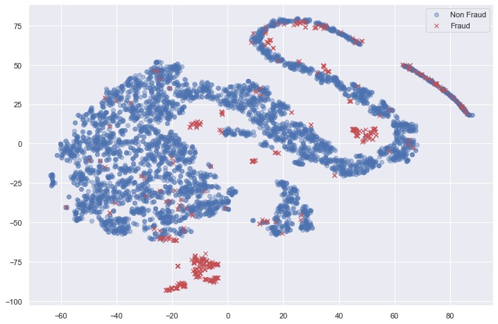
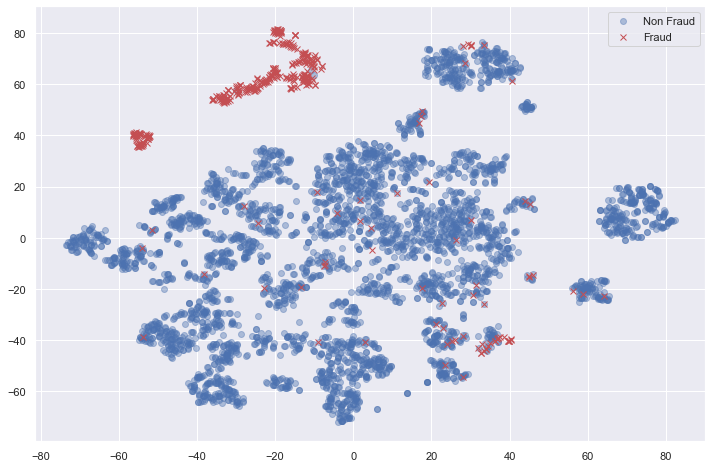

# Credit card fraud detection with Autoencoders

**Task**: Demonstrate the use of autoencoders to train a highly imbalance and 
high-dimensional data set of credit card records

This demonstration is done on a jupyter notebook.

### Prerequisites:
* Python 3
* Jupyter notebook
* Keras (TensorFlow backend)
* sklearn
* numpy, seaborn, pandas
* data source: [Kaggle](https://www.kaggle.com/mlg-ulb/creditcardfraud)

### Description
This notebook demonstrates the use of autoencoders as part of a semi-supervised 
approach to model a highly imbalance and high-dimensional data set. 

Here is a tSNE plot of the original dataset:

Obviously, the two target class are highly inseparable at its originally state.

Now, we train an autoencoder with this data and extract the latent features of this dataset from the network. By plotting the latent features with tSNE again we get the following:

We see that it is much easier to separate the 2 target classes using the latent features than the original ones. It is so well separated that one a simple logistic regression can yield very accurate predictions (over 90%)! Check out the notebook `credit-card-fraud-classifier.ipynb` for details.

